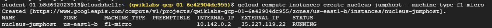
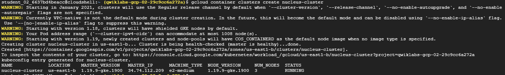
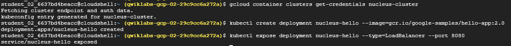
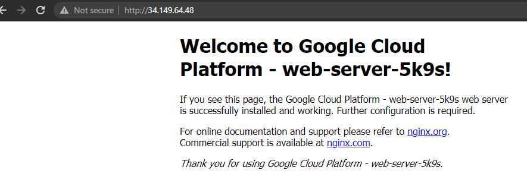
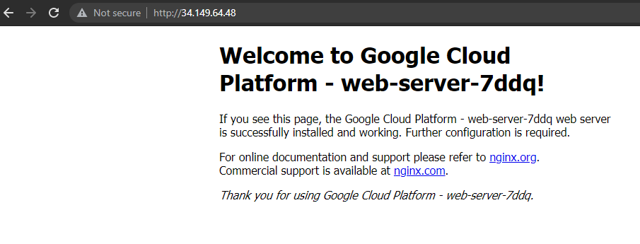

# Google cloud lab - Create and Manage Cloud Resources

I decided to complete a Google Cloud Lab to practice and improve my cloud skills. The labs are structured in such a way where there are a few 'walkthrough' type courses which introduce the necessary skills required to take on the final challenge which I decided to documented my solution for. The lab can be accessed [here](https://google.qwiklabs.com/catalog_lab/2443).


## Challenge scenario

The scenario here has been taken directly from the contents of the lab.

> You have started a new role as a Junior Cloud Engineer for Jooli, Inc. You are expected to help manage the infrastructure at Jooli. Common tasks include provisioning resources for projects. You are expected to have the skills and knowledge for these tasks, so step-by-step guides are not provided.

> Some Jooli, Inc. standards you should follow: 
> - Create all resources in the default region or zone, unless otherwise directed.
> - Naming normally uses the format team-resource; for example, an instance could be named nucleus-webserver1.
> - Allocate cost-effective resource sizes. Projects are monitored, and excessive resource use will result in the containing project's termination (and possibly yours), so plan carefully. This is the guidance the monitoring team is willing to share: unless directed, use f1-micro for small Linux VMs, and use n1-standard-1 for Windows or other applications, such as Kubernetes nodes.

### Task 0

Before I even read the tasks required of this challenge I took the following snippet directly from my notes.

```
gcloud config set project <PROJECT_ID>
gcloud config set compute/zone us-east1-b
gcloud config set compute/region us-east1
```

A project id needs set so that the gcloud utility knows where to create all of the resources, in this lab I was provided with a gcloud account and project id I had to use. I will also typically set default compute zones and regions so that I don't need to specify them (usually incorrectly) with every command.


### Task 1

#### Problem

> Task 1: Create a project jumphost instance
You will use this instance to perform maintenance for the project.
> Requirements:
> - Name the instance nucleus-jumphost.
> - Use an f1-micro machine type.
> - Use the default image type (Debian Linux).

#### Solution

This was a relatively easy one line solution, setting the image type wasn't even required as Debian Linux is used by default.

```
gcloud compute instances create nucleus-jumphost --machine-type f1-micro
```



### Task 2

#### Problem

> The team is building an application that will use a service running on Kubernetes. You need to:
> - Create a cluster (in the us-east1-b zone) to host the service.
> - Use the Docker container hello-app (gcr.io/google-samples/hello-app:2.0) as a place holder; the team will replace the container with their own work later.
> - Expose the app on port 8080.

#### Solution

This wasn't quite as straightforward as the first task but wasn't too far away from what was done in one of the 'walkthrough' labs, so was able to rely on my notes for the most part. I made an attempt to follow the standard naming convention specified in the given scenario.

I created a standard cluster (zone specified matches default zone) and fetched the credentials from it to be used by the kubectl tool. Using kubectl I created a deployment using the provided image hosted on the google container registry and exposed the cluster on the required port using a kubernetes load balancer. 


```
gcloud container clusters create nucleus-cluster
gcloud container clusters get-credentials nucleus-cluster
kubectl create deployment nucleus-hello --image=gcr.io/google-samples/hello-app:2.0
kubectl expose deployment nucleus-hello --type=LoadBalancer --port 8080
```




As you can see there were quite a few warnings when creating a cluster with no arguments specified, so it may have been worth spending extra time fine turning which arguments it was run with but it was smart enough to pick good defaults that worked.

## Task 3

#### Problem

> You will serve the site via nginx web servers, but you want to ensure that the environment is fault-tolerant. Create an HTTP load balancer with a managed instance group of 2 nginx web servers. Use the following code to configure the web servers; the team will replace this with their own configuration later.
> - Create an instance template.
> - Create a target pool.
> - Create a managed instance group.
> - Create a firewall rule to allow traffic (80/tcp).
> - Create a health check.
> - Create a backend service, and attach the managed instance group.
> - Create a URL map, and target the HTTP proxy to route requests to  your URL map.
> -Create a forwarding rule.


#### Solution

I was starting to think getting this badge was going to be a walk in the part until I saw this final task, because of the hour time limit on the lab I ended up having to retake it twice because of this task Thankfully, the task was broken down into steps which made it far more manageable and I was able to successfully complete the lab. 

I started by running the following snippet of code that was provided which creates a file called startup.sh which installs and runs a nginx server.

```
cat << EOF > startup.sh
#! /bin/bash
apt-get update
apt-get install -y nginx
service nginx start
sed -i -- 's/nginx/Google Cloud Platform - '"\$HOSTNAME"'/' /var/www/html/index.nginx-debian.html
EOF
```

The next step was to create an instance template using the startup file just created which was simple enough, reading ahead I decided to include a tag "allow-health-check" that could be matched against the firewall rules later. Using this template I created a managed instance-group based on this template with a size of 2 as specified.

```
gcloud compute instance-templates create nucleus-server-template \
   --tags=allow-health-check \
   --metadata-from-file startup-script=startup.sh

gcloud compute instance-groups managed create nucleus-server-group \
   --template=nucleus-backend-template \
   --size=2
```

At this stage I gave up taking screenshots after each and every command due to the countdown clock so you'll just have to trust the final result.


For the health-checks to be performed successfully a range of ip addresses need access to the instances, this was taken directly from Google cloud's docs [here](https://cloud.google.com/load-balancing/docs/health-checks). In short I am allowing access to port 80 for the following source ranges on instances with the "allow-health-check" tag I created as part of the instance template.

```
gcloud compute firewall-rules create nucleus-server-firewall \
    --network=default \
    --action=allow \
    --direction=ingress \
    --source-ranges=130.211.0.0/22,35.191.0.0/16 \
    --target-tags=allow-health-check \
    --rules=tcp:80
```

With the firewall configured the health checks need to be created, for this example we'll be doing a simple check to ensure web traffic is being served. This basic health check can they be added to the backend service and the backend service to the server group.

```
gcloud compute health-checks create http http-basic-check

gcloud compute backend-services create nucleus-backend-service \
    --protocol=HTTP \
    --health-checks=http-basic-check 

gcloud compute backend-services add-backend nucleus-backend-service \
    --instance-group=nucleus-server-group \
    --global
```

To route the incoming http traffic a load balancing proxy is created from a url map which directs traffic to the backend-service.

```
gcloud compute url-maps create nucleus-server-map \
    --default-service nucleus-backend-service

gcloud compute target-http-proxies create http-lb-proxy \
    --url-map nucleus-server-map
```

Finally a global forwarding rule (which in hindsight should have been given a static ipv4 address) is used to forward all traffic on port 80 to the http proxy. I then list the forwarding rules to get the ip address selected.

```
gcloud compute forwarding-rules create http-content-rule \
    --global \
    --target-http-proxy= http-lb-proxy \
    --ports=80

gcloud compute forwarding-rules list
```

I was slightly worried as the lab hadn't recognised that the load balancer was working correctly so to verify that everything was working I opened up the IP address in a web browser and hit refresh a few times and sure enough the page was being served from a total of 2 different instances as defined when creating the managed instance group.




Thankfully upon returning to the lab it was showing 100 percent complete so there must have been a small delay between provisioning everything and noticing it was complete.

## Evidence of completion


[Badge Link](https://google.qwiklabs.com/public_profiles/9afd5ebd-ad20-424c-a441-0c5a1e94424e/badges/1125381)
